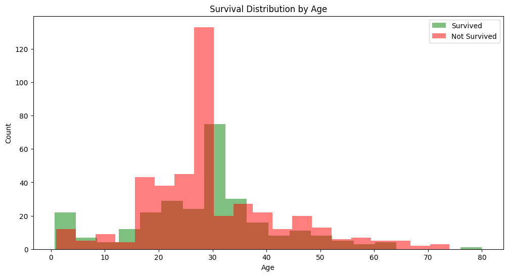
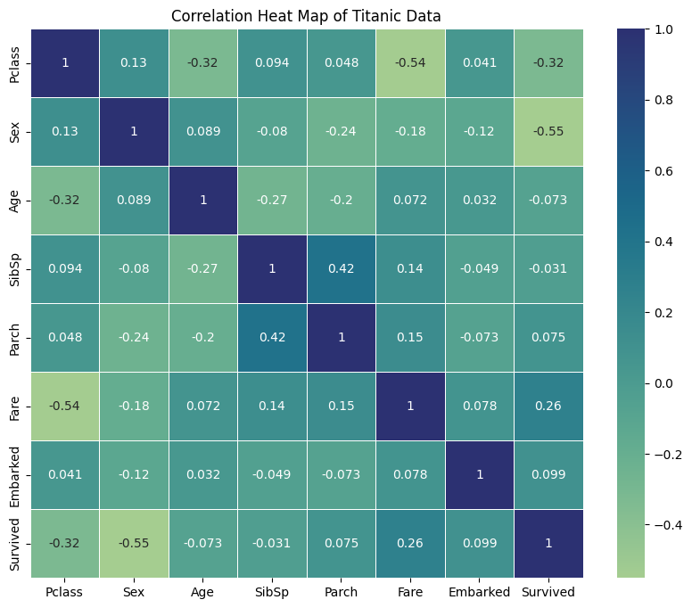
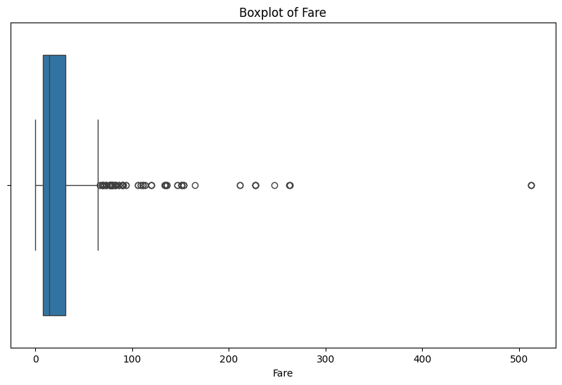
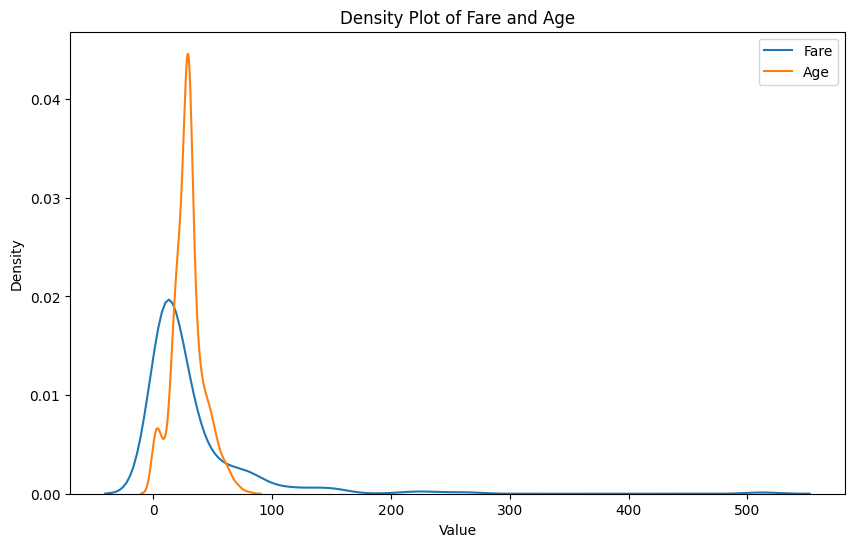

# Supervised Learning flow - Titanic Dataset
This project involves a supervised learning approach to predict the survival of passengers on the Titanic. Utilizing the Titanic dataset, the project explores various machine learning models to classify the passengers. The analysis includes data preprocessing, feature engineering, model training, and evaluation, providing insights into the factors that influenced survival rates.

## Part 1 - Experiments


```python
import pandas as pd
import numpy as np
import matplotlib.pyplot as plt
import seaborn as sns

from sklearn.model_selection import GridSearchCV
from sklearn.preprocessing import StandardScaler, MinMaxScaler
from sklearn.naive_bayes import GaussianNB
from sklearn.neighbors import KNeighborsClassifier
from sklearn.ensemble import RandomForestClassifier
from sklearn.tree import DecisionTreeClassifier
from sklearn.linear_model import LogisticRegression
from sklearn.pipeline import Pipeline

from sklearn.metrics import accuracy_score, precision_score, recall_score, f1_score, confusion_matrix, classification_report

```


```python
# Loading the two datasets
test_df = pd.read_csv("titanic_test.csv")
train_df = pd.read_csv("titanic_train.csv")
```


```python
print("Test dataset:")
test_df.head()
```

    Test dataset:
    


<div>
<style scoped>
    .dataframe tbody tr th:only-of-type {
        vertical-align: middle;
    }

    .dataframe tbody tr th {
        vertical-align: top;
    }

    .dataframe thead th {
        text-align: right;
    }
</style>
<table border="1" class="dataframe">
  <thead>
    <tr style="text-align: right;">
      <th></th>
      <th>Pclass</th>
      <th>Sex</th>
      <th>Age</th>
      <th>SibSp</th>
      <th>Parch</th>
      <th>Fare</th>
      <th>Embarked</th>
      <th>Survived</th>
    </tr>
  </thead>
  <tbody>
    <tr>
      <th>0</th>
      <td>3</td>
      <td>1</td>
      <td>35.000000</td>
      <td>0</td>
      <td>0</td>
      <td>7.0500</td>
      <td>0</td>
      <td>0</td>
    </tr>
    <tr>
      <th>1</th>
      <td>3</td>
      <td>1</td>
      <td>30.000000</td>
      <td>0</td>
      <td>0</td>
      <td>7.2500</td>
      <td>0</td>
      <td>0</td>
    </tr>
    <tr>
      <th>2</th>
      <td>3</td>
      <td>1</td>
      <td>29.699118</td>
      <td>0</td>
      <td>0</td>
      <td>14.5000</td>
      <td>0</td>
      <td>0</td>
    </tr>
    <tr>
      <th>3</th>
      <td>3</td>
      <td>0</td>
      <td>21.000000</td>
      <td>0</td>
      <td>0</td>
      <td>7.7500</td>
      <td>2</td>
      <td>0</td>
    </tr>
    <tr>
      <th>4</th>
      <td>3</td>
      <td>1</td>
      <td>32.000000</td>
      <td>0</td>
      <td>0</td>
      <td>56.4958</td>
      <td>0</td>
      <td>1</td>
    </tr>
  </tbody>
</table>
</div>


```python
print("Train dataset:")
train_df.head()
```

    Train dataset:
    


<div>
<style scoped>
    .dataframe tbody tr th:only-of-type {
        vertical-align: middle;
    }

    .dataframe tbody tr th {
        vertical-align: top;
    }

    .dataframe thead th {
        text-align: right;
    }
</style>
<table border="1" class="dataframe">
  <thead>
    <tr style="text-align: right;">
      <th></th>
      <th>Pclass</th>
      <th>Sex</th>
      <th>Age</th>
      <th>SibSp</th>
      <th>Parch</th>
      <th>Fare</th>
      <th>Embarked</th>
      <th>Survived</th>
    </tr>
  </thead>
  <tbody>
    <tr>
      <th>0</th>
      <td>1</td>
      <td>0</td>
      <td>54.0</td>
      <td>1</td>
      <td>0</td>
      <td>78.2667</td>
      <td>1</td>
      <td>1</td>
    </tr>
    <tr>
      <th>1</th>
      <td>2</td>
      <td>0</td>
      <td>45.0</td>
      <td>0</td>
      <td>0</td>
      <td>13.5000</td>
      <td>0</td>
      <td>1</td>
    </tr>
    <tr>
      <th>2</th>
      <td>3</td>
      <td>1</td>
      <td>20.0</td>
      <td>0</td>
      <td>0</td>
      <td>9.5000</td>
      <td>0</td>
      <td>0</td>
    </tr>
    <tr>
      <th>3</th>
      <td>3</td>
      <td>1</td>
      <td>36.0</td>
      <td>0</td>
      <td>0</td>
      <td>7.8958</td>
      <td>0</td>
      <td>0</td>
    </tr>
    <tr>
      <th>4</th>
      <td>3</td>
      <td>1</td>
      <td>22.0</td>
      <td>0</td>
      <td>0</td>
      <td>8.0500</td>
      <td>0</td>
      <td>0</td>
    </tr>
  </tbody>
</table>
</div>


#### EDA


```python
train_df.describe()
```


<div>
<style scoped>
    .dataframe tbody tr th:only-of-type {
        vertical-align: middle;
    }

    .dataframe tbody tr th {
        vertical-align: top;
    }

    .dataframe thead th {
        text-align: right;
    }
</style>
<table border="1" class="dataframe">
  <thead>
    <tr style="text-align: right;">
      <th></th>
      <th>Pclass</th>
      <th>Sex</th>
      <th>Age</th>
      <th>SibSp</th>
      <th>Parch</th>
      <th>Fare</th>
      <th>Embarked</th>
      <th>Survived</th>
    </tr>
  </thead>
  <tbody>
    <tr>
      <th>count</th>
      <td>712.000000</td>
      <td>712.000000</td>
      <td>712.000000</td>
      <td>712.000000</td>
      <td>712.000000</td>
      <td>712.000000</td>
      <td>712.000000</td>
      <td>712.000000</td>
    </tr>
    <tr>
      <th>mean</th>
      <td>2.294944</td>
      <td>0.640449</td>
      <td>29.531213</td>
      <td>0.528090</td>
      <td>0.384831</td>
      <td>32.379429</td>
      <td>0.372191</td>
      <td>0.394663</td>
    </tr>
    <tr>
      <th>std</th>
      <td>0.841990</td>
      <td>0.480206</td>
      <td>13.188028</td>
      <td>1.055052</td>
      <td>0.803085</td>
      <td>49.836074</td>
      <td>0.649970</td>
      <td>0.489122</td>
    </tr>
    <tr>
      <th>min</th>
      <td>1.000000</td>
      <td>0.000000</td>
      <td>0.670000</td>
      <td>0.000000</td>
      <td>0.000000</td>
      <td>0.000000</td>
      <td>0.000000</td>
      <td>0.000000</td>
    </tr>
    <tr>
      <th>25%</th>
      <td>1.750000</td>
      <td>0.000000</td>
      <td>22.000000</td>
      <td>0.000000</td>
      <td>0.000000</td>
      <td>7.925000</td>
      <td>0.000000</td>
      <td>0.000000</td>
    </tr>
    <tr>
      <th>50%</th>
      <td>3.000000</td>
      <td>1.000000</td>
      <td>29.699118</td>
      <td>0.000000</td>
      <td>0.000000</td>
      <td>14.500000</td>
      <td>0.000000</td>
      <td>0.000000</td>
    </tr>
    <tr>
      <th>75%</th>
      <td>3.000000</td>
      <td>1.000000</td>
      <td>35.000000</td>
      <td>1.000000</td>
      <td>0.000000</td>
      <td>31.275000</td>
      <td>1.000000</td>
      <td>1.000000</td>
    </tr>
    <tr>
      <th>max</th>
      <td>3.000000</td>
      <td>1.000000</td>
      <td>80.000000</td>
      <td>8.000000</td>
      <td>6.000000</td>
      <td>512.329200</td>
      <td>3.000000</td>
      <td>1.000000</td>
    </tr>
  </tbody>
</table>
</div>


```python
# Checking null values and Dtypes
train_df.info()
```

    <class 'pandas.core.frame.DataFrame'>
    RangeIndex: 712 entries, 0 to 711
    Data columns (total 8 columns):
     #   Column    Non-Null Count  Dtype  
    ---  ------    --------------  -----  
     0   Pclass    712 non-null    int64  
     1   Sex       712 non-null    int64  
     2   Age       712 non-null    float64
     3   SibSp     712 non-null    int64  
     4   Parch     712 non-null    int64  
     5   Fare      712 non-null    float64
     6   Embarked  712 non-null    int64  
     7   Survived  712 non-null    int64  
    dtypes: float64(2), int64(6)
    memory usage: 44.6 KB
    


```python
# Finding duplicated rows
print("Number of duplicated rows: " + str(train_df.duplicated().sum()))
```

    Number of duplicated rows: 80
    


```python
# Showing a cross tabulation to show how many survived from each port of embarkation
pd.crosstab(train_df['Embarked'],train_df['Survived'])
```


<div>
<style scoped>
    .dataframe tbody tr th:only-of-type {
        vertical-align: middle;
    }

    .dataframe tbody tr th {
        vertical-align: top;
    }

    .dataframe thead th {
        text-align: right;
    }
</style>
<table border="1" class="dataframe">
  <thead>
    <tr style="text-align: right;">
      <th>Survived</th>
      <th>0</th>
      <th>1</th>
    </tr>
    <tr>
      <th>Embarked</th>
      <th></th>
      <th></th>
    </tr>
  </thead>
  <tbody>
    <tr>
      <th>0</th>
      <td>333</td>
      <td>180</td>
    </tr>
    <tr>
      <th>1</th>
      <td>58</td>
      <td>76</td>
    </tr>
    <tr>
      <th>2</th>
      <td>40</td>
      <td>24</td>
    </tr>
    <tr>
      <th>3</th>
      <td>0</td>
      <td>1</td>
    </tr>
  </tbody>
</table>
</div>


```python
# Creating two sets where column "Survived" is 1 (survived) and 0 (not survived)
survived_data = train_df[train_df['Survived'] == 1]
not_survived_data = train_df[train_df['Survived'] == 0]

plt.figure(figsize=(12, 6))

# Histogram for survived
plt.hist(survived_data['Age'], bins=20, color='green', alpha=0.5, label='Survived')

# Histogram for not survived
plt.hist(not_survived_data['Age'], bins=20, color='red', alpha=0.5, label='Not Survived')

plt.xlabel('Age')
plt.ylabel('Count')
plt.title('Survival Distribution by Age')
plt.legend()
plt.show()

```


    

    


```python
# Calculating and creating correlation matrix
corr = train_df.corr()
plt.figure(figsize=(10, 8))
sns.heatmap(corr, annot=True, cmap='crest', linewidths=0.5)

plt.title('Correlation Heat Map of Titanic Data')
plt.show()
```


    

    


```python
# Checking outliers for Fare using boxplot
plt.figure(figsize=(10, 6))
sns.boxplot(x=train_df['Fare'])
plt.title('Boxplot of Fare')
plt.xlabel('Fare')
plt.show()
```


    

    


```python
# Using this next plot to show the data before scaling (continuous variables)
fig, ax = plt.subplots(figsize=(10, 6))

# Plot the KDE for Fare
sns.kdeplot(train_df['Fare'], ax=ax, label='Fare')

# Plot the KDE for Age
sns.kdeplot(train_df['Age'], ax=ax, label='Age')

ax.set_xlabel('Value')
ax.set_ylabel('Density')
ax.set_title('Density Plot of Fare and Age')
ax.legend()
plt.show()
```


    

    


#### Feature Engineering


```python
'''From the boxplot above we identified that there are outliers that their fare was over 200.
We have decided to ignore the other outliers since they are passengers from high price classes'''

# Removing outlier
# train dataframe
train_df = train_df[train_df['Fare'] <= 200]

# train dataframe
test_df = test_df[test_df['Fare'] <= 200]

```


```python
# Removing duplicated passengers instances

print("Number of duplicated rows before removal: " + str(train_df.duplicated().sum()))
# train dataframe
train_df.drop_duplicates(inplace=True)

# test dataframe
test_df.drop_duplicates(inplace=True)

print("Number of duplicated rows after removal: " + str(train_df.duplicated().sum()))
```

    Number of duplicated rows before removal: 80
    Number of duplicated rows after removal: 0
    


```python
# Combining SibSp and Parch into one 'FamilySize' column

# train dataframe
train_df['SibSp'] = train_df['SibSp'] + train_df['Parch'] + 1  # +1 for the person himself
train_df.rename(columns={'SibSp': 'FamilySize'}, inplace=True)
train_df.drop(columns=['Parch'], inplace=True)

#test dataframe
test_df['SibSp'] = test_df['SibSp'] + test_df['Parch'] + 1  # +1 for the person himself
test_df.rename(columns={'SibSp': 'FamilySize'}, inplace=True)
test_df.drop(columns=['Parch'], inplace=True)
```


```python
# In the column 'Embarked' the value 3 appears only once, so replace it  

# train dataframe
most_frequent_value = train_df['Embarked'].mode()[0]
train_df['Embarked'] = train_df['Embarked'].replace(3, most_frequent_value)

# test dataframe
most_frequent_value = test_df['Embarked'].mode()[0]
test_df['Embarked'] = test_df['Embarked'].replace(3, most_frequent_value)
```


```python
# Bin the age column

# train dataframe
train_df['Age'] = pd.cut(train_df['Age'], bins=[0, 12, 18, 60, 80, np.inf], labels=False, right=False)

# test dataframe
test_df['Age'] = pd.cut(test_df['Age'], bins=[0, 12, 18, 60, 80, np.inf], labels=False, right=False)
```

#### Training Evaluation


```python
features_names = ['Pclass', 'Sex', 'Age', 'FamilySize', 'Fare', 'Embarked']
features = train_df[features_names].copy()
target_feature = train_df['Survived']

# Classifiers dict
classifiers = {
    'Naive Bayes': GaussianNB(),
    'KNN': KNeighborsClassifier(),
    'Random Forest': RandomForestClassifier(),
    'Decision Tree': DecisionTreeClassifier(),
    'Logistic Regression': LogisticRegression()
}

# Hyperparameters dict
hyperparameters = {
    'Naive Bayes': {},
    'KNN': {'clf__n_neighbors': [3, 5, 7], 'clf__weights': ['uniform', 'distance']},
    'Random Forest': {'clf__n_estimators': [50, 100], 'clf__max_depth': [None, 5, 10]},
    'Decision Tree': {'clf__max_depth': [None, 5, 10], 'clf__min_samples_split': [2, 5, 10]},
    'Logistic Regression': {'clf__C': [0.1, 1.0, 10.0], 'clf__max_iter': [50, 100, 200]}
}

# Scalers dict
scalers = {
    'StandardScaler': StandardScaler(),
    'MinMaxScaler': MinMaxScaler()
}

# Cross-validation with grid search for each classifier and scaling method with different params
results = {}
best_estimators = {}
for classifier_name, clf in classifiers.items():
    for scaler_name, scaler in scalers.items():
        pipeline = Pipeline([('scaler', scaler), ('clf', clf)])
        clf_grid = GridSearchCV(pipeline, hyperparameters[classifier_name], cv=5, scoring='f1')
        clf_grid.fit(features, target_feature)
        results[f'{classifier_name} ({scaler_name})'] = clf_grid.best_score_
        best_estimators[f'{classifier_name} ({scaler_name})'] = clf_grid.best_estimator_

results_df = pd.DataFrame.from_dict(results, orient='index', columns=['Best F1 Score'])

# Finding the best combination
best_combo = results_df.idxmax()['Best F1 Score']
best_estimator = best_estimators[best_combo]


print('Best F1 Score:', results_df.max()['Best F1 Score'])
print(results_df)
print('\nBest Combination:', best_combo)
```

    Best F1 Score: 0.7486305949038117
                                          Best F1 Score
    Naive Bayes (StandardScaler)               0.707236
    Naive Bayes (MinMaxScaler)                 0.707236
    KNN (StandardScaler)                       0.722936
    KNN (MinMaxScaler)                         0.715867
    Random Forest (StandardScaler)             0.732579
    Random Forest (MinMaxScaler)               0.722761
    Decision Tree (StandardScaler)             0.742107
    Decision Tree (MinMaxScaler)               0.748631
    Logistic Regression (StandardScaler)       0.706626
    Logistic Regression (MinMaxScaler)         0.706875
    
    Best Combination: Decision Tree (MinMaxScaler)
    

## Part 3 - Training flow
Use the best combination of feature engineering, model (algorithm and hyperparameters) from the experiment part (part 2)


```python
# Using the best estimator that was extracted in previous part to train the entire train_df
best_estimator.fit(features, target_feature)
```


Pipeline(steps=[(&#x27;scaler&#x27;, MinMaxScaler()),
                (&#x27;clf&#x27;,
                 DecisionTreeClassifier(max_depth=10, min_samples_split=10))])</pre><b>In a Jupyter environment, please rerun this cell to show the HTML representation or trust the notebook. <br />On GitHub, the HTML representation is unable to render, please try loading this page with nbviewer.org.</b></div><div class="sk-container" hidden><div class="sk-item sk-dashed-wrapped"><div class="sk-label-container"><div class="sk-label fitted sk-toggleable"><input class="sk-toggleable__control sk-hidden--visually" id="sk-estimator-id-1" type="checkbox" ><label for="sk-estimator-id-1" class="sk-toggleable__label fitted sk-toggleable__label-arrow fitted">&nbsp;&nbsp;Pipeline<a class="sk-estimator-doc-link fitted" rel="noreferrer" target="_blank" href="https://scikit-learn.org/1.5/modules/generated/sklearn.pipeline.Pipeline.html">?<span>Documentation for Pipeline</span></a><span class="sk-estimator-doc-link fitted">i<span>Fitted</span></span></label><div class="sk-toggleable__content fitted"><pre>Pipeline(steps=[(&#x27;scaler&#x27;, MinMaxScaler()),
                (&#x27;clf&#x27;,
                 DecisionTreeClassifier(max_depth=10, min_samples_split=10))])</pre></div> </div></div><div class="sk-serial"><div class="sk-item"><div class="sk-estimator fitted sk-toggleable"><input class="sk-toggleable__control sk-hidden--visually" id="sk-estimator-id-2" type="checkbox" ><label for="sk-estimator-id-2" class="sk-toggleable__label fitted sk-toggleable__label-arrow fitted">&nbsp;MinMaxScaler<a class="sk-estimator-doc-link fitted" rel="noreferrer" target="_blank" href="https://scikit-learn.org/1.5/modules/generated/sklearn.preprocessing.MinMaxScaler.html">?<span>Documentation for MinMaxScaler</span></a></label><div class="sk-toggleable__content fitted"><pre>MinMaxScaler()</pre></div> </div></div><div class="sk-item"><div class="sk-estimator fitted sk-toggleable"><input class="sk-toggleable__control sk-hidden--visually" id="sk-estimator-id-3" type="checkbox" ><label for="sk-estimator-id-3" class="sk-toggleable__label fitted sk-toggleable__label-arrow fitted">&nbsp;DecisionTreeClassifier<a class="sk-estimator-doc-link fitted" rel="noreferrer" target="_blank" href="https://scikit-learn.org/1.5/modules/generated/sklearn.tree.DecisionTreeClassifier.html">?<span>Documentation for DecisionTreeClassifier</span></a></label><div class="sk-toggleable__content fitted"><pre>DecisionTreeClassifier(max_depth=10, min_samples_split=10)</pre></div> </div></div></div></div></div></div>


## Part 4 - Apply on test and show model performance estimation


```python
features = test_df[features_names].copy()
target_feature = test_df['Survived']

# Predicting on the test set using the best estimator
target_feature_pred = best_estimator.predict(features)

# Evaluating model performance
accuracy = accuracy_score(target_feature, target_feature_pred)
precision = precision_score(target_feature, target_feature_pred)
recall = recall_score(target_feature, target_feature_pred)
f1 = f1_score(target_feature, target_feature_pred)
conf_matrix = confusion_matrix(target_feature, target_feature_pred)
class_report = classification_report(target_feature, target_feature_pred)
```

#### Showing results


```python
print('Model Performance on Test Set:')
print('Accuracy:', accuracy)
print('Precision:', precision)
print('Recall:', recall)
print('F1 Score:', f1)
print('Confusion Matrix:\n', conf_matrix)
print('Classification Report:\n', class_report)

fig, axes = plt.subplots(1, 2, figsize=(14, 6))

sns.heatmap(conf_matrix, annot=True, fmt='d', cmap='plasma', annot_kws={"size": 16}, ax=axes[0])
axes[0].set_xlabel('Predicted')
axes[0].set_ylabel('Actual')
axes[0].set_title('Confusion Matrix')

metrics = {'Precision': precision, 'Recall': recall, 'F1 Score': f1}
axes[1].bar(metrics.keys(), metrics.values(), color=['olive', 'magenta', 'chocolate'])
axes[1].set_xlabel('Methods')
axes[1].set_ylabel('Score')
axes[1].set_title('Model Performance')
axes[1].set_ylim(0, 1) 

plt.tight_layout()
plt.show()
```

    Model Performance on Test Set:
    Accuracy: 0.85625
    Precision: 0.8541666666666666
    Recall: 0.7192982456140351
    F1 Score: 0.780952380952381
    Confusion Matrix:
     [[96  7]
     [16 41]]
    Classification Report:
                   precision    recall  f1-score   support
    
               0       0.86      0.93      0.89       103
               1       0.85      0.72      0.78        57
    
        accuracy                           0.86       160
       macro avg       0.86      0.83      0.84       160
    weighted avg       0.86      0.86      0.85       160
    
    


    

    

